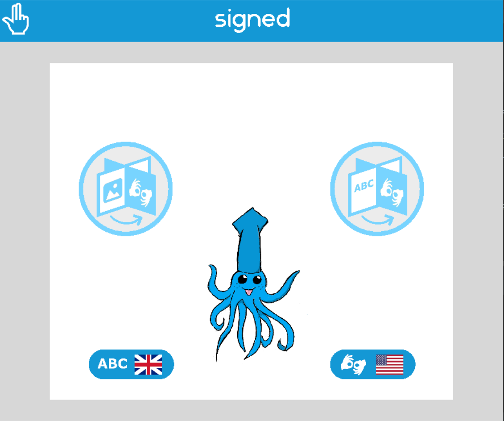
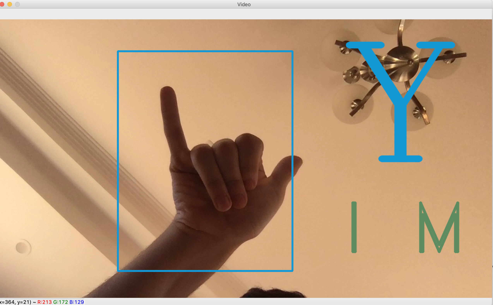
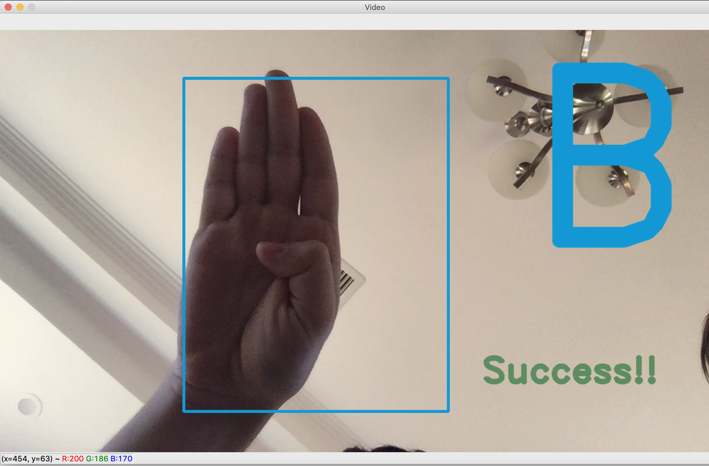

# SUMOHackathon2020

Using OpenCV and NN to provide real time feedback on sign language education.

SUMO Hackathon Project for team **Vault Dwellers**

## Usage

If you wish to run the GUI, please cd into the `gui` folder and run `python3 pages.py`. Tkinter should come preinstalled with your python distribution, so no additional requirements are needed.

To run the detection script, please cd into the root directory, `SUMOHackathon2020` and run the following commmand:

```bash
foo@bar:~$ python3 sign_checker.py -m <model_name> [-t <target_letter>] [-w <path_to_weights_file>] 
```

The model name should be one of:
- resnet 
- vgg16
- inception 
- xception
- mobilenet

The weights files can be found in the `weights` directory. Please ensure that the weights are only used with the corresponding neural network architechture. 

This region will be passed to the classifier and our model will predict the most likely ASL fingerspelt alphabet. 

This will launch a window that grabs live video captures and shows a region of interest for you to sign in. If you did not provide a target letter, the script will be launched in testing mode, and will display the region of interest, as well as the top predictions from the NN, provided that the confidence value is greater than 0.5. 

If a target letter was provided, the script will instead display the target letter. When the target letter is identified consistently over a short timescale, the script will provide a `Success!!` message and exit. 

This targeting mode is the intended mode for usage in the **Signed** gui. 

## Demo Images

Please insert images here using this syntax 








## References

Neural Network was trained by: https://github.com/BelalC/sign2text

- Most of the code for computer vision and NN was used from or largely based on this source.
- Sources for pitch and initial research: 
- Stats on deafness: https://www.who.int/news-room/facts-in-pictures/detail/deafness
- [English literacy as a barrier to health care information for deaf people who use Auslan ](https://d1wqtxts1xzle7.cloudfront.net/33719433/2013_Napier_AFP.pdf?1400291642=&response-content-disposition=inline%3B+filename%3DEnglish_literacy_as_a_barrier_to_healthc.pdf&Expires=1602034757&Signature=gxXI1R2vpLPYJaCXijUwYP-TU6jopZcdlc2Qf74nXk3eK4jhKZD3ePB~4OabDV-Vl11kvI2qbW62q~DrGBgrQXKC-9cwasCBgUpaGTaYMNRCLCbtLEGc259by~OT2iGSpR4BNJhMgcnD6wSqqK4rhFJMyBonBKUboTPXyps7c92Vjb30koR1uJB51QU1zJMLGkUnnS0nNyd-9Hsd7y6ydq6QsZB6GJIZK5kCb2cLkOfEFREXv8nHq-4jSg-dus2H9wFn5Cnb9Clez4z0y0fJmDFjjYgMQ3qcW~7OVuSgygzXREqS4a5zM5-i51v~ivyRKLiTLa~UI2LS9jR2pRjqLw__&Key-Pair-Id=APKAJLOHF5GGSLRBV4ZA)
- Healthcare info: https://theconversation.com/accessing-healthcare-is-challenging-for-deaf-people-but-the-best-solution-isnt-one-size-fits-all-127734
- Interpreter Shortage: https://mable.com.au/newsroom/auslan-national-shortage/
- Qualification: https://smartandskilled.nsw.gov.au/sands/qualification/PSP51018
- Initial source pg 6-7: https://issuu.com/srcpubs/docs/honi_soit_2018__semester_02__week_0_4e6d77f51585ac
